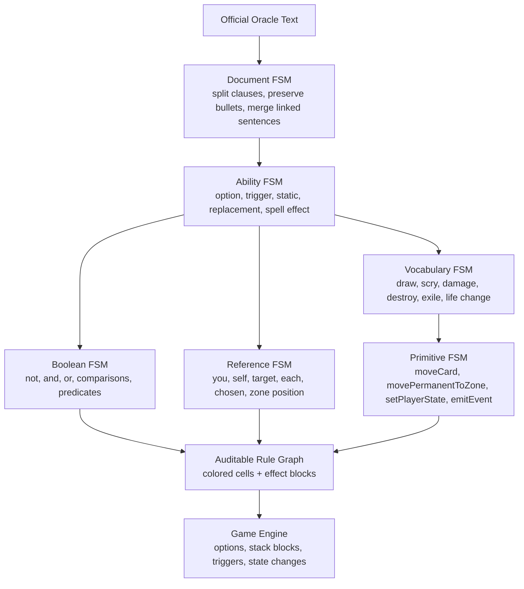

# Magic Rule Language

## Purpose

- Provide a shared language for Oracle parsing, Card Analysis, and the game engine.
- Separate the smallest game-state operations from Magic vocabulary such as draw, mill, destroy, scry, cast, resolve, and trigger handling.
- Make parsed card text auditable by showing which part of each oracle clause maps to references, timing, costs, conditions, choices, and effects.

## Section 1: Color Legend

- Green represents primitive actions that mutate game state.
- Blue represents primitive reads that inspect game state and return a value.
- Purple represents primitive predicates that return true or false.
- Yellow represents entity references, including targets, self, you, controller, owner, chosen objects, zone positions, and sets such as each creature.
- Orange represents primitive costs that must be paid before an option is committed.
- Red represents primitive triggers or game events that rules can observe.
- Cyan represents timing or speed macros that decide when options are offered to a player.
- Gray represents pure logic and calculations such as `and`, `or`, `not`, comparison, arithmetic, min, max, and if/else branching.
- Brown represents Magic vocabulary composed from primitives, such as draw, mill, destroy, exile, scry, damage, copy, sacrifice, cast, and resolve.
- White represents effect blocks or abilities, which are the indivisible units placed on the stack or resolved as one continuous instruction sequence.

## Section 2: Action Primitives

- Action primitives only mutate state; they do not encode full Magic concepts when those concepts require targeting rules, replacement effects, prevention, triggers, or timing.
- Core action primitives include moving cards between zones, creating permanents, removing permanents, creating and removing stack items, changing mana pools, setting player state, setting card state, setting permanent state, setting permanent properties, setting stack item properties, changing counters, attaching objects, detaching objects, adding rule modifications, removing rule modifications, enqueuing choices, and recording choices.
- Ordered zones are changed through explicit position-aware actions, such as moving the top card of a library, placing known cards on top or bottom in a chosen order, and shuffling a zone.

## Section 3: Reads, Predicates, And Logic

- Primitive reads inspect the current game state and return values such as power, toughness, counter count, permanent count, mana pool contents, cards drawn this turn, card zone, object controller, and current step.
- Primitive predicates answer yes or no by combining references, reads, and pure logic, such as `isCreature`, `isTapped`, `canPayMana`, `isControlledBy`, `isLegalTarget`, `hasPriority`, `isMainPhase`, and `isStackEmpty`.
- Pure logic combines values and predicates without reading or mutating state directly; boolean structure must be explicit with `and`, `or`, `not`, comparisons, arithmetic, and grouping.

## Section 4: Entity References And Targets

- Entity references identify objects, players, zones, or sets of objects in context.
- References include `you`, `opponent`, `controller`, `owner`, `self`, `this spell`, `this permanent`, `target creature`, `chosen card`, `that card`, `it`, `top card of your library`, and `each creature`.
- True Magic targets are a subtype of entity reference and must be chosen before a spell or ability is placed on the stack.
- Target legality must account for target type, visibility, controller restrictions, protection, hexproof, shroud, ward, and any source-specific targeting restrictions.
- Non-target references such as `each creature`, `choose a creature`, and sacrifice choices are not blocked by hexproof or ward unless the card text explicitly uses target wording.
- Multiple targets are represented as named target specs with minimum count, maximum count, distinctness, candidate references, and legality predicates.

## Section 5: Costs And Options

- Costs are paid before an option is committed to the stack or resolved as a special action.
- Costs can include mana payment, tapping the source, sacrificing objects, discarding cards, exiling cards, paying life, removing counters, or making required choices.
- A player option is available only when its timing macro allows it, its source is in the required zone, its costs are payable, and all required targets currently have valid candidates.
- If an option has several legal modes, targets, or cost payments, the engine exposes a required choice packet to the human UI or AI decision system.

## Section 6: Timing And Speed

- Timing or speed is modeled as an option-availability macro, not as a resolved effect.
- Instant speed listens to priority windows and offers options to the player with priority.
- Sorcery speed listens to priority windows and additionally requires the active player, a main phase, and an empty stack.
- Other timing macros can require combat, a specific step, a specific phase, once-per-turn limits, or text such as activate only as a sorcery.
- Mana abilities are a special timing family because supported mana abilities resolve immediately instead of creating a normal stack item.

## Section 7: Triggers And Events

- Triggers observe named game events and may create triggered ability blocks.
- Named events include cast, enter battlefield, leave battlefield, enter graveyard, leave graveyard, draw, mill, scry, surveil, discard, gain life, lose life, damage, beginning of upkeep, beginning of draw, beginning of first main, beginning of combat, declare attackers, declare blockers, damage order, beginning of second main, and beginning of end step.
- Triggered rules combine an observed event with predicate logic before creating their effect block.
- Vocabulary actions should emit standard events so rules such as whenever a player draws, whenever a creature dies, and whenever you gain life can observe the result.

## Section 8: Magic Vocabulary

- Magic vocabulary is composed from references, reads, predicates, costs, logic, triggers, and action primitives.
- Draw, mill, discard, scry, surveil, destroy, sacrifice, exile, damage, gain life, lose life, copy, cast, resolve, counter, tap, and untap are vocabulary terms rather than raw primitives when they need Magic semantics.
- Vocabulary terms may expand into primitive scripts, emit events, request choices, apply replacement effects, or perform target revalidation.
- Damage is vocabulary because prevention, replacement, lifelink, deathtouch, marked damage, player damage, planeswalker damage, and battle damage can alter or observe it.

## Section 9: Effect Blocks And The Stack

- The stack contains effect blocks, not individual primitive actions.
- An effect block may contain timing, source zone, targets, costs, conditions, mode choices, and an ordered resolution script.
- Once an effect block starts resolving, players do not receive priority between its internal primitive or vocabulary steps unless the block explicitly creates a new choice required by that resolution.
- If all required targets of a spell or ability become illegal before resolution, that stack item fizzles according to normal target rules.
- Lands are special actions: playing a land does not create a spell stack item, but enter-battlefield hooks and replacement choices still apply.

## Section 10: Card Rule Composition

- A parsed card rule can be an option producer, triggered ability, static rule modifier, replacement effect, or special action.
- Each parsed rule must declare the official oracle segment it came from, its references, timing, costs, targets, conditions, choices, and effect block.
- Adjacent oracle sentences may merge into one parsed rule when the card uses one ability across multiple sentences.
- Unsupported segments remain visible with parser diagnostics and user feedback fields; incomplete parse results must not silently add game behavior that could change the card's meaning.

## Section 11: Finite-State Parser Levels

- The Oracle parser is layered so high-level structure is detected before low-level Magic vocabulary is expanded.
- The document-level state machine splits official Oracle text into clauses, preserves modal bullet lines, and merges adjacent clauses that form one ability.
- The ability-level state machine classifies a segment as an option, triggered ability, static modifier, replacement effect, spell effect, or unsupported clause.
- The boolean-level state machine parses condition expressions with explicit `not`, `and`, `or`, comparisons, and grouped predicate calls.
- The reference-level state machine resolves entity references such as `you`, `self`, `target`, `chosen`, `that card`, zone positions, and each/set references.
- The vocabulary-level state machine recognizes Magic terms such as draw, mill, scry, damage, destroy, exile, copy, and life change.
- The primitive-level state machine expands supported vocabulary to action primitives, choice requests, event emissions, and state mutations.

## Section 12: Parser Audit Output

- Card Analysis can expose the rule graph for each oracle segment using the shared color legend.
- Each segment can show high-level cells, effect blocks, script steps, primitive expansions, parser state, unsupported tokens, and user feedback.
- The simulator consumes target requirements and supported effect metadata from the parser instead of duplicating target regexes in UI code.
- Representative project cards used as parser fixtures include conditional lands, tap mana lands, modal spells such as Abrade, can-not-be-countered spells, nonland permanent exile, linked life changes, Opt-style scry/draw effects, and Slickshot-style cast-pump triggers.
